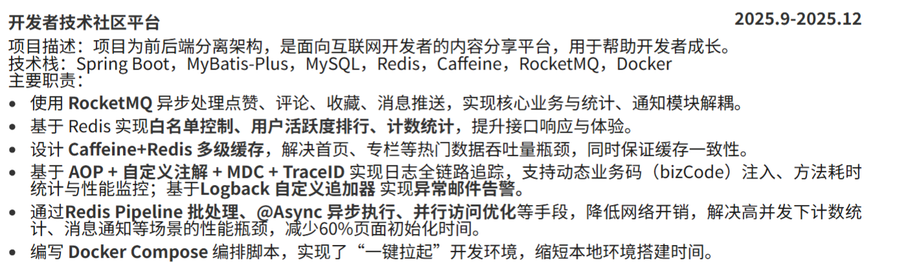

# 项目思考

## 问题一：项目的意义就是学技术栈

这个阶段，我做项目的出发点很单纯，就是为了学习技术栈，比如做黑马点评就是为了学习里面的后端技术栈，比如Spring Boot、数据库等；做RAG项目就是为了学习RAG的流程。
但是问题是这个项目的意义是学习，不是给别人使用，所以不要问我：在这个场景为什么要用这些技术？我不知道，我使用它的原因是我想学习他，所以我在这里使用了他。

于是我的简历就变成了技术点的大杂烩：用了 Redis 做缓存、用了消息队列削峰、用了分库分表……
所以这个时期我的简历是这样的：
由很多的技术点堆在一起组成，我天真的认为，技术越多越好，所以有的要点还是由多个技术点组成。

这就导致了一个问题：我知道 STAR 原则，但我不理解为什么要这样写。因为按 STAR 写，一个项目只能展开一两个点；不按 STAR 写，我可以堆很多个技术点。而且我不知道怎么把一个技术点拆成 Situation / Task / Action / Result——"实现了 Redis 白名单控制"，实现了就实现了，有什么情景任务行动结果可言？

我觉得原因是：首先我的初衷就不是做一个给别人使用的项目，所以我不会去考虑技术的抉择、权衡，也就没有情景、目标可言。

## 问题二：没有止境的优化

开始学习RAG之后，因为RAG项目的核心指标就是召回率，我开始堆砌优化策略。

RAG 项的整个流程——从文档分片、向量检索到生成回答——每一个环节都可以优化。我将看起来很厉害的策略放在简历上面，我在网上搜索Agent开发简历，然后从别人的简历上面找到他们的优化策略，将看起来很厉害的策略写在简历上面。

所以其实这个问题和上一个问题差不多，只是堆积的东西不一样，上一个是堆积技术栈，到了RAG里面变成了堆积优化策略。

所以我开始思考一件事情，我做的这些事情有没有意义？就算我在上面写出来了最高级的策略，那我和别人的也不过是80步和100步的区别。

## 问题三：项目同质化严重

问题和前一个差不多，我将精力用在策略优化上，但是我做的东西和别人做的差不多，都是RAG，都是点评，都是外卖。

## 问题三：没有测评、没有权衡

### 没有测评

在此之前，我一直觉得感觉有用就行了，比如召回策略，我用混合检索肯定比你的纯向量检索厉害。

第一次意识到这个问题是在一次面试中，面试官问：那你怎么知道你的优化策略是有用的？但是其实这个时候我的想法是，面试官要问这个问题，那我要求准备一下，但是其实我心里面是不重视的。

知道我在优化RAG项目时，我想要给他加上一个策略是：动态路由，大概就是通过分类策略将简单问题过滤出来，以此减少向量查询的调用，直接返回结果，达到减少耗时的效果。我的想法是：这不是一看就可以节约时间吗，我都不需要去向量检索了。但是后来我实际测试才发现，向量检索在整个检索+组织答案的流程中，耗时最多的是调用大模型组织答案的过程，而检索占用的时间是毫秒级的，节约的时间非常有限，且因为我使用的关键词+正则进行匹配，所以准确率不高。但是又不能使用大模型进行分类，因为分类的时间都远大于检索的时间。

这件事情就告诉我不是你觉得策略有效就有效。

### 没有权衡

在我测评之后没我的数据提升了，这个策略就是可用的吗？就是一个好策略吗？还需要权衡。

你要学会思考这个策略的代价是什么？比如ReRank，在我实际测试中，没有rerank的时候，耗时60ms，加上他就变成了360ms，这是代价，好处是召回排序更好了。综合下来，这个增加的耗时在整个链路中的占比不算大，但是排序优化更好，所以在大部分场景是值得的。还有比如你为了解决大表查询慢的问题，你做了分库分表，就会导致运维风险、系统复杂度上升。

这些你都要考虑。

## 阶段四：创新-解决一个实际问题

为什么做workflow项目、好处：\
第一点是：我的目标是解决一个实际问题，所以我就相当于也有一个目标，就解决了第一个问题。

第二点是：这是一个我自己想出来的解决办法，所以不会同质化，更有新意。

坏处：

第一点是：你的想法、策略不一定是有用的，所以你的项目做到最后你可能会发现别人的策略更好？但是能经历这个过程，能讲清楚你的认识也是比较好的

第二点是：为什么别人都写哪些项目，可能原因是哪些项目包含了面试官需要的技术栈，而你的项目可能就没有

第三点是：你的内心会保持怀疑，也就是我现在的状态，在没有成功找到实习之前，你都不知道自己的做的到底对不对，缺少肯定
